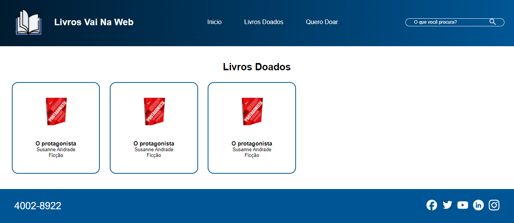
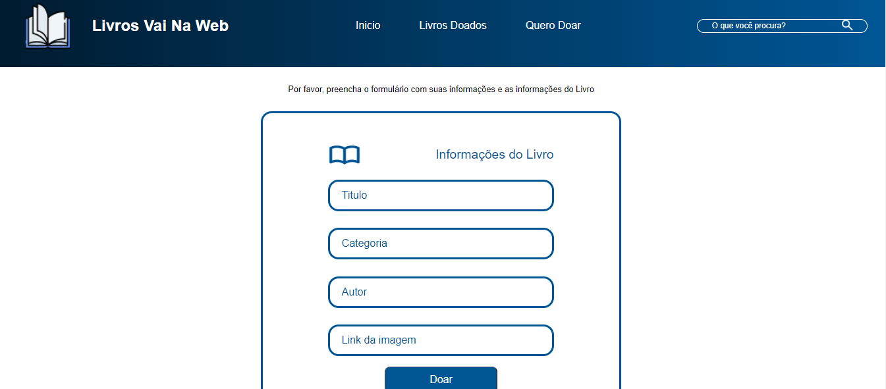

# Templete: site de doação de livros

O presente projeto tem como finalidade a construção de um templete para um site de doação de livros, assim é possível ver os livros que já foram recebidos como efetivar uma doação, além da página principal que conta com uma breve explicação do projeto.

## O templete foi desenvolvido utilizando:
- node: v20.16.0
- npm: v10.8.1
- react: v18.3.1
    - react-router-dom
    - vite: v5.4.10
- sass: v1.81.0

## Imagens do templete disponível para os visitantes da página:

- Tela principal:

- Livros doados:

- Tela de doação dos livros

#### Desde já agradeço sua atenção!
